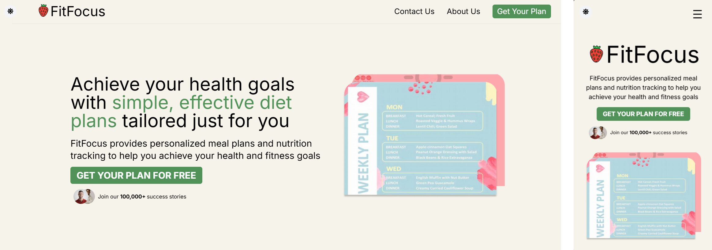

<h1>Description</h2>

FitFocus is a web application designed to deliver customized diet plans directly to your inbox. It provides users with personalized, actionable nutrition advice through regular newsletters, helping them stay on track with their fitness and health goals.

<h2>Project URL </h2>
https://sameersharmadev.github.io/fitfocus/
 

<h2>Technologies used</h2>

+ HTML
+ CSS
+ Javascript
+ TailwindCSS
+ SCSS

<h2>Features</h2>

+ User friendly interface
+ Responsivene and clean design
+ Free newsletter system
+ Multi-step form to signup
+ Optional donation section

